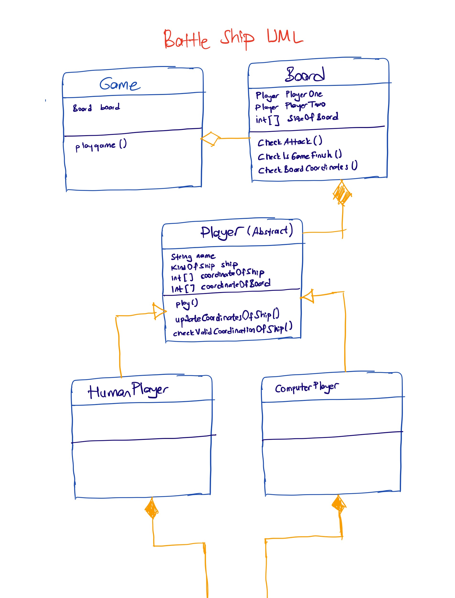
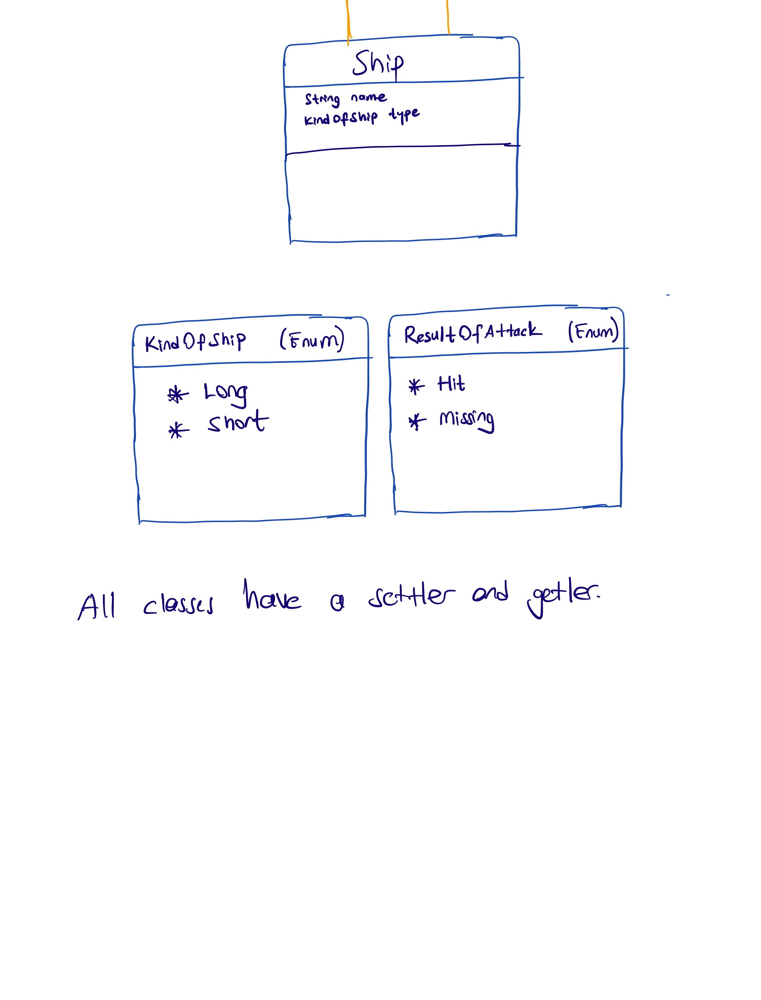

# BattleShip

This project doen't have full code for the game.  
CreatePhoneNumber purpose of this project is creating the hierarchy and relations of the classes.  
Many times methods are explained with comments.  

## Game Rules  

🔸 This is a simple game of battleship.  
🔸 The game is played onn n*n grid that is defined by the user.  
🔸 There are two players, human and computer.  
🔸 There are two types of ships, long and short.  
🔸 Players has a one ship.  
🔸 The App chose a random player to start the game.  
🔸 The Player hit the ship, the player get the next shot  
🔸 If a player fails to hit the ship, it is the other player's turn.    
🔸 The player who sinks the other player's ship wins the game.  

## UML DIAGRAM  

